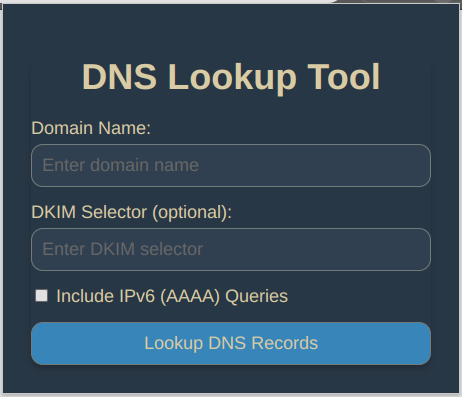

# Browser plugin for DNS Lookups

_Initial published version 24.02_

***NOTE:*** Currently there is an issue with chrome based browsers, the results are not displayed as expected. Please run the plugin in ***incognito mode***.
No issues with Firefox. 

## Description

For a given domain and DKIM selector (optional) the tool generates an output displaying the results of various DNS queries, including A, AAAA, MX, NS, DKIM, SPF, DMARC, and CNAME records. By default, IPv6 queries are disabled. The results are neatly presented in a new tab for easy reference.

## Getting Started

1. ### Create a folder on your local system then download the below mentioned files / folder to the new created folder:

- ***manifest.json***  
> The manifest file that describes your extension to the browser.

- ***popup.html***  
> The HTML file for the extension's popup UI, where users input the domain and optional DKIM selector, enable/disable IPv6 queries and copy the generated output.

- ***popup.js***  
> The JavaScript file linked from popup.html that handles user input, performs DNS lookups using Cloudflare's DNS over HTTPS API, and displays the results in the popup. The brain of the extension.

- ***popup.css***  
> The CSS file linked from popup.html for styling.

- ***images folder***  
> The images folder contain 3 .png files (change them if you like) 16x16, 48x48 and 128x128 for the extension icons.

2. ### Load Extension to the Browser  
Chrome/Edge: Go to ***chrome://extensions/*** (or ***edge://extensions/*** for Edge), enable ***"Developer mode"***, and click ***"Load unpacked"***. Select the folder containing your extension's files.  
  
Firefox: Go to ***about:debugging***, click ***"This Firefox"***, and click ***"Load Temporary Add-on"***. Select the manifest file of your extension.

## Screen dumps
### Initial popup

### Results
